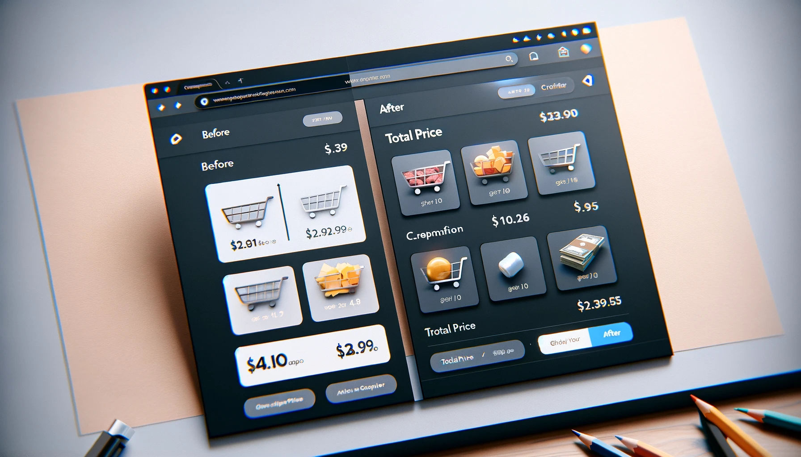

# Code Reviews

<!--This Markdown document is used as a presentation i.e. all content is short and to the point.-->

<!--some quote-->

_Code review is less about catching bugs and more about ensuring a collective ownership and shared understanding of the codebase._ - Inspired by Linus Torvalds' perspective on open-source development.

---

## Agenda

1. [Background](#background)
2. [Benefits](#the-benefits)
3. [Challenges](#challenges)
4. [Tips for authors](#tips-for-authors)
5. [Tips for reviewers](#tips-for-reviewers)
6. [Discussion](#discussion)
7. [Reflection](#reflection-and-next-steps)

---

## Background


---

### Why Is this Important?

**Without a good system for code reviews, we might run into problems like:**

- _It's tricky to give feedback when it's not clear what we're dealing with._
- _Big changes all at once can be a lot to take in and hard to follow._
- _When changes try to do too many things at once, it makes it tough to check them and might cause problems later._

---

### All of these problems can lead to:

- Slower review times.
- Higher changes of missed bugs.
  - When context is missing or changes are too big, it's easy to miss things.
- Higher change for segmenting the team's understanding of the codebase.

---

### Well, what benefits do we get from code reviews?

- Do I get my PR merged faster?
- Are we catching bugs?
- Do I get to learn something new?

---

Yes... and more!

---

## The Benefits

- **Improving code quality.**
- **Shared understanding and collective ownership**
- **Learning from each other**
- **Catching oversights**
- **Future Context**
- **Team can better enforce architecture decisions**
- **Better understanding of the product**
- **Reading code for learning**

---

Although general Code Reviews might not always become faster due to the time spent on them, I'd argue at least for the large changes will be more efficient and less error-prone.

---

## Challenges

- **As an Author**
  - Waiting a long time
  - Conflicting feedback - especially offline vs online
- **As a Team**
  - Velocity impacted by review times
- **As a Reviewer**
  - Giving good feedback can be hard
  - Being afraid to come across as too critical/nitpicky

---

## Tips for authors

How to write PRs that are easier to review


---

### Tip 1 - Self-Review

- **Before you submit your PR, review it yourself.**
- **Look at it from the remote repo i.e. Azure DevOps, GitHub, etc.**
  - You can do this in a draft PR before adding reviewers.

---

### Tip 2 - Smaller PRs

- **Break down your changes into smaller, more digestible PRs.**
- **Separation of concerns in PRs**
  - Minor related refactors and bugfixes can be in the same PR - but separate commits.
  - Separate PRs for new features and bugfixes and refactorings that are not directly related.
- **Don't be afraid to merge fragments of work - Feature toggle**
  - Long-lived branches can be a pain to merge and review - Avoid them.

---

### Git can be scary,

so if you want it, I will create a workshop on Git.


---

### Tip 3 - More Context

PR descriptions are important! Template by colleague [Source](https://gist.github.com/coprolit/0a0456b80a22d31d47557c57577c12ec#situation-solution-template)

```markdown
## Situation

(What is the current behavior?)
(Here you can give context to the changes, and hint at the type of needed changes, e.g. new feature, bugfix, refactoring, etc.)

## Solution

(What is the new behavior?)
(Here you should clarify the intent of the changes and explain what the changes do.)

## Feedback Focus (Optional)

(What do you want reviewers to focus on?)
```

Also, use screenshots, gifs, and diagrams where relevant.

---

#### Example

```markdown
## Situation

Currently, the user can only see the list of items in the cart. The user cannot see the total price of the items in the cart.

## Solution

I have added a new component that displays the total price of the items in the cart.
The component is displayed at the bottom of the cart list.

## Feedback Focus

- I would like feedback on the design of the component and the placement of the component in the UI.
- In doubt if the archetecture is correct, your feedback and suggestions are welcome.
```



---

#### This could be beneficial to have in the git commit message as well.

- The `Situation` and `Solution` parts can be in the commit message.
  - Easier to understand the changes in the git history.
  - Not lost in fragile link to PR.

---

### Tip 4 - Prioritize Readability

- **Spend a little extra time on naming variables, functions, and classes.**
- **Split boolean logic into multiple variables or lines.**
- **Prefer if-else over ternary operators for readability.**
  - Especially when nested ternaries.
- **Can make sense for the team to have a style guide.**
  - This should be discussed by the team - added where can be to setup rules in lint and formatting tools.

---

### Tip 5 - For the large PRs that needs to be large

- **Invite for an in person meeting**
  - Have discussions about the changes before the PR is submitted.
  - In person code reviews can be beneficial for large complex changes.
- **Remember to update the PR description with the feedback from the meeting.**
  - This is so that the feedback is not lost and can be referred to later.

**NOTE:** When there are more than 3 replies in a PR, it might be time to have a meeting.

---

## Tips for reviewers

How to give good feedback


---

### Tip 1 - Prefer Questions over Statements

- **Instead of saying "This is wrong", ask "Have you considered this?"**
- **What are the benefits of...**
- **Is this here because...**

This can lead to a discussion instead of a one-way feedback.

---

### Tip 2 - Provide better learning platform

- **When giving feedback or suggesting changes, explain why and if possible provide resources.**

_You may want to use a different approach here, see <link>, this is a common performance issue._

---

### Tip 3 - Recap offline discussions

- **When you have had offline discussions about the PR, make sure to recap them shortly in the PR.**

This is so we can use that for understanding the change in the future.

---

### Tip 4 - Create tasks in the PR

- **If you see something that needs to be fixed, create a task in the PR.**
  - This can be done in Azure DevOps, GitHub, etc.
  - It makes it easy for the author to keep track of what needs to be done.
  - It is also easy for everyone to follow the progress.

---

## Discussion


---

## Discussion

- **What are some challenges you have faced with code reviews?**

---

## Discussion

- **What can we do to make it easier review PRs?**

---

## Discussion

- **Should we worry less about unfinished features on main and save feature-toggling for staging/test branching?**

---

## Discussion

- **How long would you expect between submitting a pull request and having it reviewed?**

---

## Discussion

- **Should we add the description template as a default on PRs?**

---

## Discussion

- **Should we add the description template as a default on PRs?**
  - _"Isn't this the guy that removed the template?"_

---

## Discussion

- **Should we add the description template as a default on PRs?**
  - _"Isn't this the guy that removed the template?"_
    - Yes

---

## Discussion

- **Should adding/changing commits on a PR remove approvals?**

---

## Discussion

- **Can we improve tooling or infrastructure to reduce friction on code review?**

---

## Reflection

- **How does code review fit into your work day?**

---

## If you take one thing away from this presentation...

- **PRs should always only contain changes that are related.**
  - If you address something like a bug, documentation, or refactoring that is not related to the PR, create a new PR for it.
  - This keeps the PRs small and easier to review for one, but it allows us to use git as a tool when a commit is bad.

---

<!-- color: #ffffff; -->

# And remember, code reviews are a way to learn from each other and improve the codebase more than catching bugs.

Even though catching bugs is a nice side effect.


