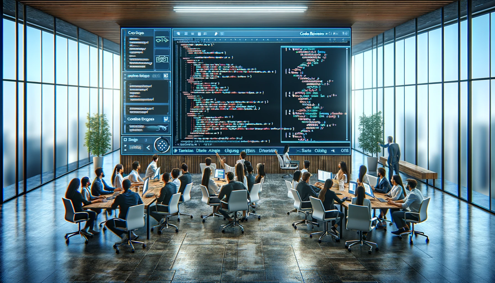

# Code Reviews

<!--This Markdown document is used as a presentation i.e. all content is short and to the point.-->

<!--some quote-->

_Code review is less about catching bugs and more about ensuring a collective ownership and shared understanding of the codebase._ - Inspired by Linus Torvalds' perspective on open-source development.

---

## Agenda

1. [Background](#background)
2. [Benefits](#the-benefits)
3. [Challenges](#challenges)
4. [Tips for authors](#tips-for-authors)
5. [Tips for reviewers](#tips-for-reviewers)
6. [Discussion](#discussion)
7. [Reflection and Next Steps](#reflection-and-next-steps)

---

## Background

---

### Why Is this Important?

**Without a good system for code reviews, we might run into problems like:**

- _It's tricky to give feedback when it's not clear what we're dealing with._
- _Big changes all at once can be a lot to take in and hard to follow._
- _When changes try to do too many things at once, it makes it tough to check them and might cause problems later._

---

### All of these problems can lead to:

- Slower review times.
- Higher changes of missed bugs.
  - When context is missing or changes are too big, it's easy to miss things.
- Higher change for segmenting the team's understanding of the codebase.

---

#### Well, what benefits do we get from code reviews?

- Do I get my PR merged faster?
- Are we catching bugs?
- Do I get to learn something new?

---

Yes... and more!

---

## The Benefits

- **Improving code quality.**
  - We can catch bugs, improve performance, and make the code easier to understand.
- **Shared understanding and collective ownership**
  - We all have a better understanding and ownership of the codebase and how it works.
- **Learning from each other**
  - We can gain from the experience and knowledge of others.

---

Although general Code Reviews might not always become faster due to the time spent on them, I'd argue that the benefits outweigh the costs.

---

## Challenges

<!-- - **Time** -->
<!--   - It takes time to do a good review. -->
<!-- - **Feedback** -->
<!--   - It's hard to give good feedback. -->
<!-- - **Understanding** -->
<!--   - It's hard to understand the changes. -->
<!-- - **Ownership** -->
<!--   - It's hard to feel ownership of the codebase. -->

---

## Tips for authors

...

---

## Tips for reviewers

...

---

## Discussion

...

---

## Reflection and Next Steps

...
